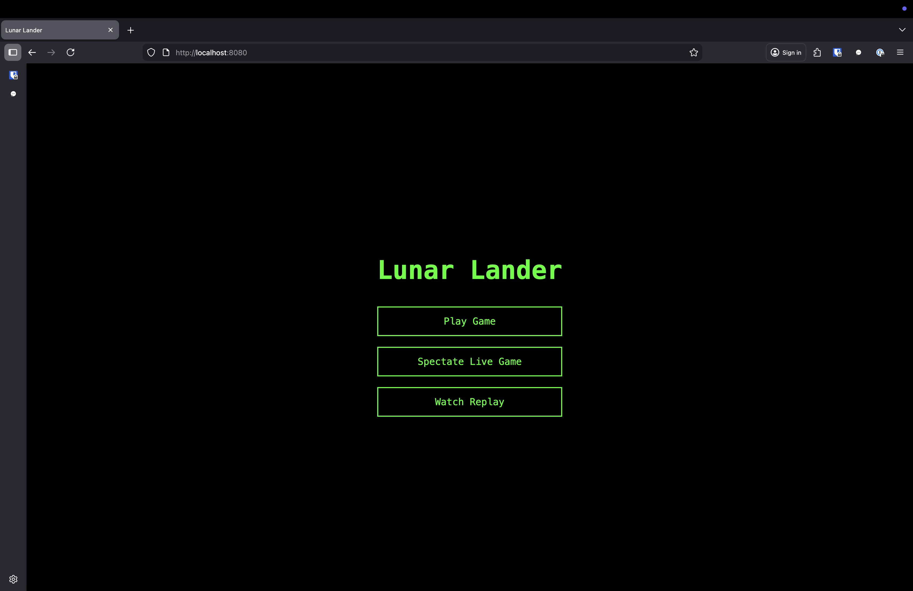

# 🚀 Lunar Lander

A modern browser-based remake of the classic 1979 Atari Lunar Lander arcade game, featuring real-time multiplayer spectating, AI support, and competitive scoring.




## 🎮 Features

### Three Difficulty Levels
- **Easy**: Gentle terrain, more fuel - Perfect for learning
- **Medium**: Moderate terrain, standard fuel - Balanced challenge  
- **Hard**: Rough terrain, limited fuel - Expert mode

### Competitive Scoring
- **Base Score**: 1,000 points for successful landing
- **Fuel Bonus**: Up to 500 points (conserve fuel!)
- **Time Bonus**: Up to 300 points (land quickly!)
- **Difficulty Multiplier**: 1x Easy, 1.5x Medium, 2x Hard
- **Maximum Score**: 3,600 points (perfect landing on Hard)

### Game Modes
- **🎮 Play**: Control the lander with keyboard
- **👁️ Spectate**: Watch live games in real-time
- **📹 Replay**: Watch recorded games

### Live Spectating
- Watch other players in real-time
- See spectator count in-game
- Full telemetry and HUD display
- Multiple spectators per game

### AI Support
- WebSocket API for AI clients
- 60Hz real-time telemetry
- Example AI included
- Perfect for competitions

## 🚀 Quick Start

### Play Locally

**1. Start the server:**
```bash
cd server
python3 -m venv ../venv
source ../venv/bin/activate
pip install -r requirements.txt
uvicorn main:app --port 8000
```

**2. Start nginx (single-port deployment):**
```bash
sudo nginx
```

**3. Open your browser:**
```
http://localhost
```

### Deploy to Internet (ngrok)

```bash
ngrok start lunarlander
```

Access via the ngrok URL - game works identically!

## 🎯 How to Play

### Controls
- **↑ Arrow Up**: Thrust (main engine)
- **← → Arrow Left/Right**: Rotate lander
- **R**: Restart after game over
- **ESC**: Return to menu

### Landing Requirements
✅ **Speed**: < 5.0 m/s total velocity  
✅ **Angle**: < 17° from vertical  
✅ **Location**: Green landing zones only

**Watch the HUD!** Speed and Angle indicators turn **GREEN** when safe to land.

### Strategy Tips
1. **Conserve fuel** - Each 1% fuel = 5 points
2. **Land quickly** - Every second after 20s costs 5 points
3. **Play on Hard** - 2x multiplier doubles your score
4. **Balance speed vs fuel** - Using thrust costs fuel but saves time

## 🤖 AI Client

### Run the Example AI
```bash
cd examples
python3 simple_ai.py
```

The AI will autonomously navigate and attempt to land.

### Build Your Own AI
Connect to `ws://localhost:8000/ws` and receive 60Hz telemetry including:
- Lander position, velocity, rotation, fuel
- Terrain height and landing zones
- Calculated altitude and speed
- Nearest landing zone with distance/direction

See [ARCHITECTURE.md](ARCHITECTURE.md) for full API documentation.

## 🏆 Scoring Examples

### Perfect Landing (Easy)
- Land in 20s with full fuel
- **Score: 1,800 points**

### Perfect Landing (Hard)
- Land in 20s with full fuel  
- **Score: 3,600 points** 🎯

### Realistic Landing (Medium)
- Land in 35s with 30% fuel
- **Score: 2,062 points**

### Crash
- **Score: 0 points** 💥

## 🔒 Security Features

Built for hacker conferences with security in mind:

- ✅ **Server-authoritative physics** - No client-side cheating
- ✅ **Rate limiting** - 30-60 requests/min per IP
- ✅ **Input validation** - Whitelist of valid actions
- ✅ **Connection limits** - 100 games, 100 spectators/game
- ✅ **Session cleanup** - Auto-remove after 10min idle
- ✅ **XSS protection** - No innerHTML usage

See [SECURITY.md](SECURITY.md) for full details.

## 📊 Stats

- **Lines of Code**: ~3,500 (Python: 1,800, JavaScript: 1,700)
- **Automated Tests**: 57 passing (unit + integration + E2E)
- **Test Coverage**: Core features covered
- **Performance**: 60Hz physics, 60fps rendering, 30Hz spectator updates

## 🛠️ Technology Stack

**Backend:**
- Python 3.14 + FastAPI
- WebSocket for real-time communication
- Server-authoritative physics at 60Hz

**Frontend:**
- HTML5 Canvas rendering
- Vanilla JavaScript (no frameworks)
- WebSocket client

**Deployment:**
- nginx reverse proxy
- ngrok for internet access
- Single-port deployment (port 80)

## 📚 Documentation

- [ARCHITECTURE.md](ARCHITECTURE.md) - Technical details, API docs, project structure
- [SECURITY.md](SECURITY.md) - Security features and testing
- [SCORING.md](SCORING.md) - Detailed scoring system
- [TESTING.md](TESTING.md) - Testing strategy and coverage
- [NGROK.md](NGROK.md) - Deployment guide

## 🎯 Project Status

**Current Version**: 1.0 (Conference Ready)  
**Completion**: 85%

### ✅ Completed
- Core gameplay with physics
- Scoring system
- Difficulty selection
- Live spectating
- Replay system
- Security hardening
- 57 automated tests
- nginx + ngrok deployment

### 🚧 Planned
- Visual polish (particles, explosions)
- Leaderboard system
- Sound effects
- Mobile touch controls

## 🤝 Contributing

Contributions welcome! The game is designed to be extensible:
- Add new AI strategies in `examples/`
- Modify physics in `server/game/physics.py`
- Add terrain generators in `server/game/terrain.py`
- Customize rendering in `client/js/renderer.js`

## 📝 License

MIT License - Feel free to use and modify!

## 🎮 Credits

Inspired by the classic 1979 Atari Lunar Lander arcade game.

Built with ❤️ for hacker conferences and AI competitions.

---

**Ready to play?** Start the server and visit http://localhost 🚀
